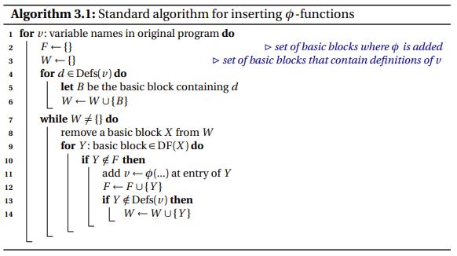

<h1>
    <div align = "center">《编译技术》实验</div>
</h1>
<h1>
    <div align = "center">优化文章</div>
</h1>


<h2>
    <div align = "center"></div>
</h2>


<h5>
    <div align = "center"></div>
</h5>


<h6>
    <div align = "center">2022年12月</div>
</h6>
<div STYLE="page-break-after: always;"></div>


[TOC]

## 一、词法分析

### 1. 正则表达式识别Token

在词法分析识别Token时，可以自己按照文法构造有穷自动机，但另一种更优秀的办法是利用正则表达式和贪婪规则进行分析，示例如下：

```java
public enum TokenType {
    /* ---------- specific elements begin ---------- */
    MAINTK(true, "main"),
    CONSTTK(true, "const"),
    INTTK(true, "int"),
    BREAKTK(true, "break"),
    CONTINUETK(true, "continue"),
    IFTK(true, "if"),
    ELSETK(true, "else"),
    WHILETK(true, "while"),
    GETINTTK(true, "getint"),
    PRINTFTK(true, "printf"),
    RETURNTK(true, "return"),
    VOIDTK(true, "void"),
    /* ---------- specific elements end ---------- */
    /* ----------- begin ---------- */
    IDENFR(false, "[_A-Za-z][_A-Za-z0-9]*"),
    INTCON(false, "[0-9]+"),
    STRCON(false, "\\\"[^\\\"]*\\\""),
    /* ---------- end ---------- */
    /* ----------- comparison operation begin ---------- */
    LEQ(false, "<="),
    LSS(false, "<"),
    GEQ(false, ">="),
    GRE(false, ">"),
    EQL(false, "=="),
    NEQ(false, "!="),
    /* ---------- comparison operation end ---------- */
    /* ---------- arithmetic operation begin ---------- */
    PLUS(false, "\\+"),
    MINU(false, "-"),
    MULT(false, "\\*"),
    DIV(false, "/"),
    /* ---------- arithmetic operation end ---------- */
    /* ---------- logical operation begin ---------- */
    NOT(false, "!"),
    AND(false, "&&"),
    OR(false, "\\|\\|"),
    MOD(false, "%"),
    /* ---------- logical operation end ---------- */
    ASSIGN(false, "="),
    SEMICN(false, ";"),
    COMMA(false, ","),
    /* ---------- brackets begin ---------- */
    LPARENT(false, "\\("),
    RPARENT(false, "\\)"),
    LBRACK(false, "\\["),
    RBRACK(false, "]"),
    LBRACE(false, "\\{"),
    RBRACE(false, "}");
    /* ---------- brackets end ---------- */
}
```

### 2. 单词串

为了便于语法分析的进行，在词法分析阶段将分析得到的单词存入自定义类`TokenList`单词串中，示例如下：

```java
public class TokenList {
    private ArrayList<Token> tokens;

    public TokenList() {
        this.tokens = new ArrayList<>();
    }

    public void addToken(Token token) {
        this.tokens.add(token);
    }

    public ArrayList<Token> getTokens() {
        return tokens;
    }
}
```

### 3. 单词迭代器

为了在语法分析时便于单词的预读与回退，设计了单词迭代器`TokenListIterator`：

```java
public class TokenListIterator {
    private TokenList tokenList;
    private ListIterator<Token> iterator;
    private Token last;

    public TokenListIterator(TokenList tokenList) {
        this.tokenList = tokenList;
        this.iterator = this.tokenList.getTokens().listIterator();
    }

    public ListIterator<Token> getIterator() {
        return iterator;
    }

    public Token readNextToken() {
        return last = this.iterator.next();
    }

    public boolean hasNext() {
        return this.iterator.hasNext();
    }

    public void unReadToken(int k) {
        int cnt = k;
        while (cnt > 0) {
            cnt--;
            if (this.iterator.hasPrevious()) {
                last = this.iterator.previous();
            } else {
                break;
            }
        }
    }

    @Override
    public String toString() {
        return last.toString();
    }
}
```

## 二、中间代码生成

本编译器的中间代码选择了LLVM IR。

### 1. SSA（静态单一赋值）

在生成LLVM IR时，采用了SSA的方法以便于后续寄存器分配和优化等。每个变量仅被赋值一次，简化了优化的实现和优化程序的效率。

在编译器的设计中，静态单赋值形式（static single assignment form，通常简写为SSA form或是
SSA）是中间代码（IR，intermediate representation)的特性，每个变量仅被赋值一次。在原始的IR中，已存在的变数可被分割成许多不同的版本，在许多教科书当中通常会将旧的变数名称加上一个下标而成为新的变数名称，以至于标明每个变数及其不同版本。在SSA，UD链（use-define chain，赋值代表define，使用变数代表use）是非常明确，而且每个仅包含单一元素。
SSA架构下每个变量仅被赋值一次从而数据流分析更加方便，因此数据流分析相关的优化也可更高效高质量的完成，也可以高效率的完成GVN(全局值编号)从而完成相关的代码优化

在`SSA_book`中，介绍了如下SSA生成算法：



在本编译器中，实现效果如下：

- SysY源码：

  ```C
  int main() {
  	int a = 1, b = 2, c = 3;
  	int x = a + b * c - a / c;
  	return 0;
  }
  ```

- LLVM IR中间代码

  ```
  declare i32 @getint()
  declare void @putint(i32)
  declare void @putch(i32)
  
  
  define dso_local i32 @main() #0 {
      %_LocalVariable0 = alloca i32
      %_LocalVariable1 = alloca i32
      %_LocalVariable2 = alloca i32
      %_LocalVariable3 = alloca i32
      store i32 1, i32* %_LocalVariable0
      store i32 2, i32* %_LocalVariable1
      store i32 3, i32* %_LocalVariable2
      %_LocalVariable4 = load i32, i32* %_LocalVariable0
      %_LocalVariable5 = load i32, i32* %_LocalVariable1
      %_LocalVariable6 = load i32, i32* %_LocalVariable2
      %_LocalVariable7 = mul i32 %_LocalVariable5, %_LocalVariable6
      %_LocalVariable8 = add i32 %_LocalVariable4, %_LocalVariable7
      %_LocalVariable9 = load i32, i32* %_LocalVariable0
      %_LocalVariable10 = load i32, i32* %_LocalVariable2
      %_LocalVariable11 = sdiv i32 %_LocalVariable9, %_LocalVariable10
      %_LocalVariable12 = sub i32 %_LocalVariable8, %_LocalVariable11
      store i32 %_LocalVariable12, i32* %_LocalVariable3
      ret i32 0
  }
  ```

可以注意到，其中的变量会被`alloca`申请空间，后续的每一次引用都会使用`load`将其加载到新的局部变量中，从而完成了SSA。

### 2. 死代码删除

#### 2.1 跳转代码删除

对于 `branch` 语句，当判断跳转的变量取固定值时，则只有一种跳转的可能，因此可删去无法跳转到的分支。

#### 2.2 一般代码删除

对于SSA形式生成的代码，删除定义了但未被使用的变量的相关语句。


## 三、中间代码优化

### 1. 基本块划分和流图

后续的多数优化方案依赖于数据流分析，因此先将中间代码划分为基本块并构建流图。

在本编译器中，`middle/llvmir/value/basicblock`下保存了中间代码基本块类和中间代码基本块生成器。具体地，如下划分基本块并构造流图：

- 基本块属于某一个具体函数的内部，不跨函数
- 最开始初始化一个大的基本块，向下解析来拆解新的基本块
  - 遇到无条件跳转语句结束该基本块，生成一个新基本块对象并将当前基本块和即将跳转的基本块连接
  - 遇到条件跳转语句结束该基本块，并于即将跳转的基本块相连接，生成一个新基本块并将当前基本块和新基本块相连接。
  - 遇到标签Label时，结束当前基本块并生成一个新的基本块，将当前基本块与新基本块连接。
- 连接基本块时，通过将其加入基本块链表来维护和保存，以便于后续数据流分析。

### 2. 活跃变量分析

活跃变量分析针对的目标是变量，其与后续寄存器分配息息相关。在本编译器中，具体实现如下：

- 计算每个基本块的`use`和`def`集合
- 由公式$out[B] = \cup_{(B的每个后继基本块P)}in[p]$和$in[B] = use[b] \cup (out[B] - def[B])$来计算每个基本块的IN和OUT集合
- 检查IN集合是否有变化，若无变化则停止，若有变化则继续重复循环。

### 3. 常量合并与常量传播

#### 3.1 基本块内

对于基本块内部的常量传播，计算方法如下：

- 新建符号表，符号表中变量和值（常量或变量）一一对应
- 顺序扫描，中间代码如果满足操作数的值都是常数，则以常数替换变量

#### 3.2 跨基本块

对于跨基本块的常量传播，由于我们之前计算得到了数据流分析，因此可以计算每个基本块的IN集合。对于某个变量，如果基本块的IN集合中只有一条中间代码对变量进行赋值操作，则将该中间代码作为该基本块的前去语句，按照基本块内的复写传播进行操作。

### 4. 删除无用循环

由于前面进行了活跃变量分析，因此在循环内部的变量在循环外不再使用时可以删去循环。

### 5. 到达定义分析

根据编译理论课讲述的内容，由公式$in[B] = \cup_{(B的每个前驱基本块P)out[P}$和$out[B] = gen[B] \cup (in[B] - kill[B])$计算IN和OUT集合，循环计算直至OUT集合稳定不变。

## 四、Mips代码生成与优化

### 1. 尽可能使用寄存器

由于前述SSA的特性，对于一些临时变量不需要给其分配内存，直接标记为临时变量，在使用后即可释放其寄存器。

### 2. 乘除优化

- 乘法优化为对操作数为常数的指令进行优化，方法是乘法转换为左移和加法操作
- 除法优化为将指令转化为乘法指令再进行乘法指令优化
- 取模运算转化为乘除指令再优化：$a \ \% \ b = a -a/b$

### 3. 窥孔优化

- 删除无用的`j,beq,bne`等跳转指令
- 删除无用的`move`指令
- 删除无用的`lw,sw`指令

## 五、寄存器分配

### 1. 寄存器使用约束

本编译器遵循mips规范使用`$a,$a,$t`等寄存器。具体地，对于一些寄存器进行如下定义和约束：

- 全局寄存器：保存跨函数变量，不需要写回内存。
- 局部寄存器：保存跨基本块变量，再函数内不需要写回内存，但是函数调用时需要根据保护现场来写回内存。
- 临时寄存器：保存基本块内变量，需要写回内存。

### 2. 图着色

由前述活跃变量分析得到变量之间的冲突图，根据编译理论课讲述的启发式算法找到一个寄存器分配方案进行分配。

